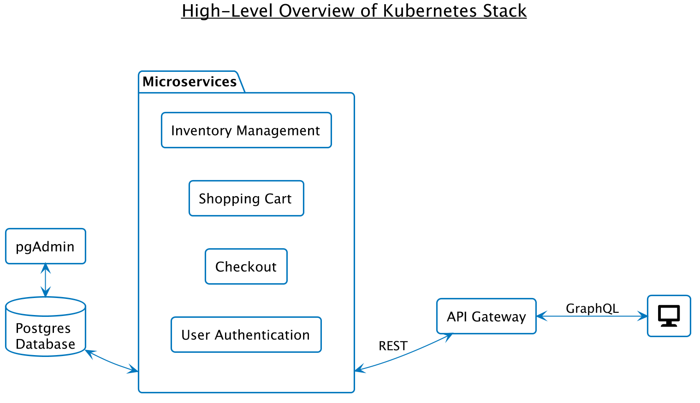

Cloud-Based E-Commerce Platform
====================================

[Presentation - Demo 1](https://docs.google.com/presentation/d/1TYmVYvuYqNWoOj4FwtnGaxnmtSnmXSqMxC14MutpX2s/edit?usp=sharing)
[Presentation - Demo 2](https://docs.google.com/presentation/d/1pIByj3ZFKsxwYGMkZmbblarH8IQ_82dd2DG20eF9ZoQ/edit?usp=sharing)
## 1. Vision and Goals Of The Project:
This project is an open-source, cloud based e-commerce solution that enables entrepreneurs to leverage this platform for individual or business purposes.
The vision for this project is one of headless design, with the front-end and back-end entirely independent from each other.
This would make the system more flexible for developers and for business operators alike, compared to the currently available alternatives.

The platform should be entirely flexible, modular and scalable in nature.
The API-driven architecture would make it a modern, high performing tech stack that easily integrates with external services or technologies.
The platform would enable shopper event data, unlock insights across sales channels, and manage sales performance in real time.

The high-level goals include:

* End-to-end user experience, from product selection to payment
* Enabling entrepreneurs to host their own businesses using this platform and create an e-commerce store
* Complete flexibility, modularity, and scalability
* Independence of front-end and back-end code
* Open-source code and transparency
* A simple UI to demonstrate the core functionality

## 2. Users/Personas Of The Project:
The e-commerce platform will be used by:

* Entrepreneurs hosting their business on the platform, who will use either the full stack of offered functionality, or specific modules
* Businesses who would want to further customize the open-source code for their specific needs
* Sales and marketing teams for analytics and to improve sales
* End-users of the business created by an entrepreneur, who will use the e-commerce system for orders and payment.

It does not target developers directly, although the modular nature of the system will make it easier for developers to integrate its services in other applications.

Furthermore, the system provides hooks to support different languages, so it would be region-independent and could be deployed in different languages.

## 3. Scope and Features Of The Project:
The main goal of this project is to develop a robust back-end which can support multiple front-ends; in particular any front-end development will be solely for testing.

Main features:

* User management & authentication: creating/deleting an account, signing in/out, profile management
* Product sales
  * Product listing
  * Search
  * Shopping cart functionality
  * Placing/cancelling orders
  * Transactions
  * Shipping & Tax calculator
  * Returns management
  * CRM system to send transactional emails
* Inventory management
* Accounting
* Admin dashboards
* Back-end
  * Secure authentication
  * Integration with third-party payment services
  * Secure user data storage
  * Messaging queues
  * Scalability to support increase/decrease in load
  * Ability to operate across multiple businesses

Additional features:

* Recommendation systems
* Analytics
* Improved security

## 4. Solution Concept
A short description of the system components that are building blocks of the architectural design:

* Back-end: Business logic implemented using Node.JS for server-side functionality like user authentication, messaging, and communicating with a database
* Front-end: UI components like login/register, shopping cart, payment page etc.
  * implemented using React.JS/ Next.JS
* End-points: Maintains all service endpoints using GraphQL/REST APIs
* Load testing: Probably Loadtest
* Deployment: Application deployment on cloud using Docker containers, with Kubernetes for scaling and management
* Server Host: Server framework on which the application runs - Nginx/ Express.JS
* Message Queues: Handling email notifications like order status, payment details etc.
  * using Apache Kafka
* Database: Data storage and retrieval system - PostgreSQL

## 5. Acceptance Criteria

The acceptance criteria are as follows:

1. Backend and frontend stack deployed on Kubernetes.
2. All code documented and checked in on Github repo, with orchestration scripts for deployment.
3. User is able to perform a purchase/transaction from the frontend.
4. Micro-services failover demonstration.
5. Backend microservices auto-scaling on increased workload.

## 6. Release planning
We are planning for a bi-weekly release.
