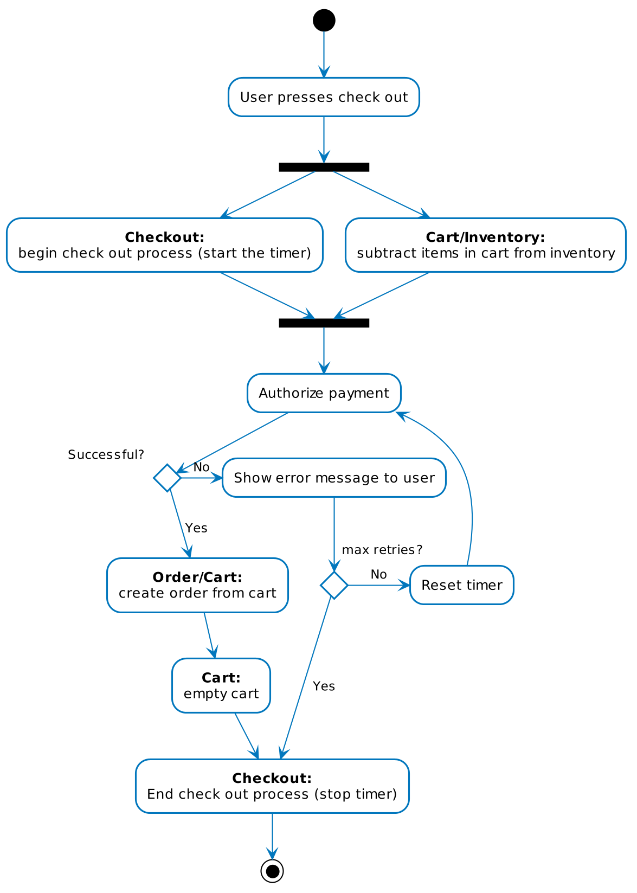

# Microservice design
## Preface - data storage
Since there should be little intercommunication between the services via API calls, an important consideration is how the microservices will access and store data.
There are two ways:

1. **Shared database**. There would be one database service, and this would be accessed by all microservices.
    * advantages: simple, much easier to implement
    * disadvantages: no separation of domain, every service can see all other services' data, dependency, difficulty of changing schema. Monolithic database contradicts microservice idea.
2. **Database per service**. There would be multiple databases, one for each microservice, which would be part of that microservice. Data would be replicated between services using e.g. the [Saga pattern](https://microservices.io/patterns/data/saga.html).
    * advantages: independence, domain-driven, bounded contexts
    * disadvantages: more complex, more difficult to implement, more parts to maintain

For more information:

* [Flight management system case study](https://blog.christianposta.com/microservices/the-hardest-part-about-microservices-data/)
* [Database per service pattern](https://microservices.io/patterns/data/database-per-service.html)

## Microservice API
Inventory management:

* add a product
* remove a product
* edit a product

Shopping cart:

* add a product
* remove a product
* empty the cart
* retrieve all products in cart

Checkout:

* begin
* abort

Order management:

* create
* retrieve
* cancel

Users:

* log in
* log out
* register
* delete account

## Diagrams/flows
### Checkout
What happens when the user presses 'check out' on the cart:

