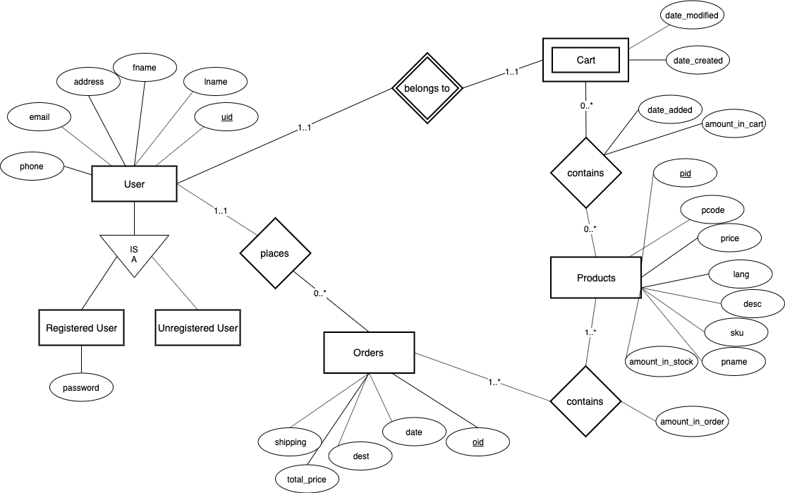

# Database design
The entity-relationship diagram:



This gives the following relations:
- Products (*pid*, pcode, price, sku, amount_in_stock, pname, desc, lang)
- Users (*uid*, fname, lname, address, phone, email, pass NULLABLE)
- Carts (*cart_id*, date_modified, date_created, uid → User)
- Products_In_Cart (*cart_id → Carts*, *pid → Product*, amount_in_cart, date_added)
- Orders (*oid*, total_price, date, destination, shipping, uid → User)
- Products_In_Order (*oid → Orders*, *pid → Products*, amount_in_order)

Resulting in the following schema:

```sql
/* Notes:
- NOT NULL constrains could be changed depending on what we want
- pcode could be alphanumeric
- price is assuming two decimal digits, could be null e.g. if not determined yet
- sku notation depends on vendor, but default to alphanumeric
- lang is language code, like en_US
*/
CREATE TABLE Products (
  pid SERIAL PRIMARY KEY,
  pcode VARCHAR(50),
  price FLOAT(2) CHECK (price IS NULL OR price >= 0),
  sku VARCHAR(50) NOT NULL,
  amount_in_stock INT CHECK(amount_in_stock >= 0),
  pname VARCHAR(50) NOT NULL,
  description TEXT NOT NULL,
  lang varchar(7) NOT NULL
);

CREATE TABLE Users (
  uid VARCHAR(20) PRIMARY KEY,
  fname VARCHAR(50) NOT NULL,
  lname VARCHAR(50) NOT NULL,
  address VARCHAR(50) NOT NULL,
  phone NUMERIC(10) NOT NULL, -- 10 digits
  email VARCHAR(50) NOT NULL,
);

CREATE TABLE Carts (
  cart_id VARCHAR(50) PRIMARY KEY,
  date_created TIMESTAMPTZ NOT NULL,
  date_modified TIMESTAMPTZ, -- could be NULL if not modified
  uid VARCHAR(20) REFERENCES Users(uid) NOT NULL
);

CREATE TABLE Products_In_Cart (
  cart_id VARCHAR(50) REFERENCES Carts(cart_id),
  pid INT REFERENCES Products(pid),
  amount_in_cart INT NOT NULL CHECK (amount_in_cart > 0), -- not equal to 0, because otherwise not in cart
  date_added TIMESTAMPTZ NOT NULL,
  PRIMARY KEY (cart_id, pid)
);

CREATE TABLE Orders (
  oid INT PRIMARY KEY,
  total_price float(2) NOT NULL CHECK (total_price >= 0),
  date TIMESTAMPTZ NOT NULL,
  destination VARCHAR(50) NOT NULL,
  shipping float(2) NOT NULL CHECK (shipping >= 0), -- shipping price
  uid VARCHAR(20) references Users(uid)
);

CREATE TABLE Products_In_Order (
  oid INT references Orders(oid),
  pid INT references Products(pid),
  amount_in_order INT NOT NULL CHECK (amount_in_order > 0),
  PRIMARY KEY (oid, pid)
);
```
